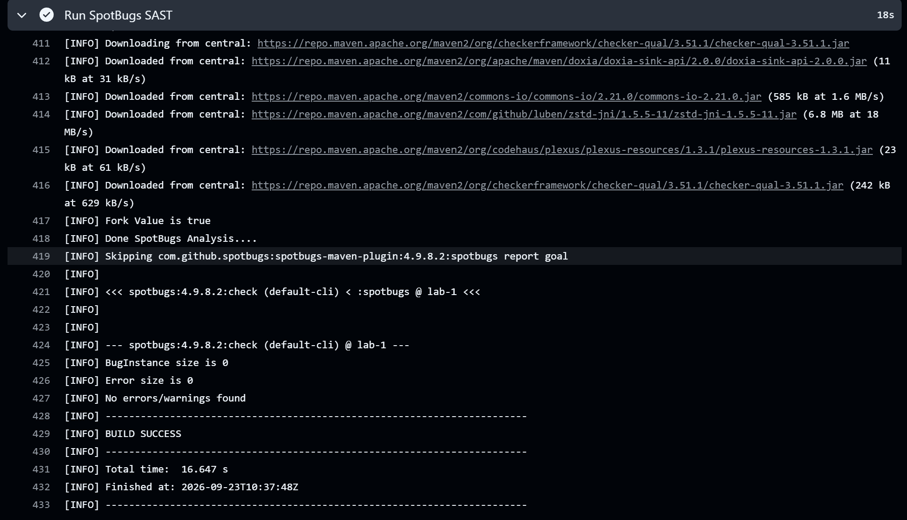
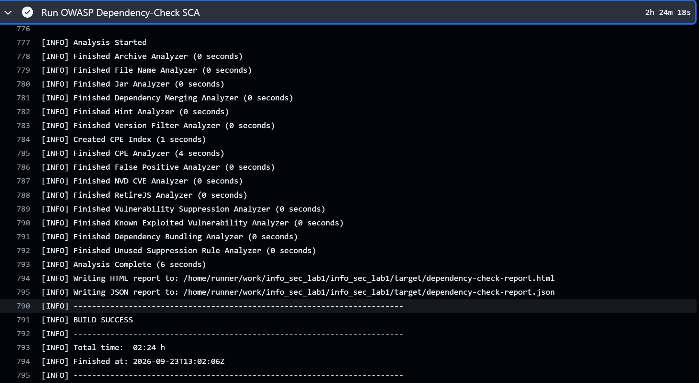

# Лабораторная работа №1 «Разработка защищенного REST API с интеграцией в CI/CD»

Приложение написано на Java 17 и Spring Boot 4.1.1, собирается
Maven. Данные хранятся в H2 in-memory. При запуске создаются пользователь `admin` и два поста.

## Список эндпоинтов

API доступен по адресу `http://localhost:8080`. При запуске создаётся пользователь `admin` с паролем `local-demo-password`.
Для доступа к защищённым эндпоинтам требуется заголовок `Authorization: Bearer <JWT>`.

### POST /auth/login - вход

Формат запроса (`Content-Type: application/json`):

```json
{
  "username": "admin",
  "password": "local-demo-password"
}
```

Формат ответа (`200 OK`):

```json
{
  "token": "<JWT>",
  "tokenType": "Bearer"
}
```

При неверных учётных данных возвращается `401 Unauthorized`.

### GET /api/data - получение списка постов

Формат ответа (`200 OK`):

```json
[
  {
    "id": 1,
    "title": "Security checklist",
    "body": "Use JWT, bcrypt and parameterized queries.",
    "author": "admin"
  }
]
```

В массиве также находятся другие сохранённые посты. Запрос без действительного токена возвращает `401 Unauthorized`.

### POST /api/posts - создание поста

Формат запроса (`Content-Type: application/json`):

```json
{
  "title": "New post",
  "body": "Secure API example"
}
```

Формат ответа (`201 Created`):

```json
{
  "id": 3,
  "title": "New post",
  "body": "Secure API example",
  "author": "admin"
}
```

Автор определяется по JWT. Заголовок ограничен 120 символами, текст ограничен 1000 символами.

### Коллекция Insomnia

Файл [insomnia/lab1-insomnia.json](insomnia/lab1-insomnia.json) содержит запросы для входа, чтения и создания постов, а
также проверки доступа без токена и экранирования XSS. Импортируйте его через `Import` -> `File`. Сначала выполните
`POST /auth/login`, затем скопируйте значение `token` из ответа в переменную `token` базового окружения коллекции.
Переменная `base_url` уже равна `http://localhost:8080`.

## Защита

### SQL-инъекции

Приложение работает с H2 через `AppUserRepository` и `PostRepository`, которые наследуют `JpaRepository`. При входе
вызывается `findByUsername(request.username())`: Spring Data JPA передаёт значение имени пользователя как параметр
запроса. Создание поста выполняется через `postRepository.save(...)`. В коде нет SQL, составляемого конкатенацией строк
с пользовательскими значениями, поэтому введённые в `username`, `title` или `body` фрагменты SQL остаются данными и не
меняют структуру запроса.

Ограничения на уровне модели дополняют проверку входа: имя пользователя имеет максимальную длину 64 символа и уникально,
заголовок поста ограничен 120 символами, тело ограничено 1000 символами. Поля запроса дополнительно проверяются
аннотациями
`@NotBlank` и `@Size`.

### XSS

Поля `title` и `body` принимаются как текст и сохраняются в базе. Перед возвратом поста `PostController.toResponse(...)`
вызывает `HtmlUtils.htmlEscape(...)` для заголовка, текста и имени автора. Это происходит и при `GET /api/data`, и в
ответе на `POST /api/posts`. Например, заголовок `<script>alert(1)</script>` возвращается как
`&lt;script&gt;alert(1)&lt;/script&gt;`. Тест `createdPostIsEscapedInApiResponse` проверяет этот случай.

Ответы API имеют формат JSON. Если клиент вставляет полученные значения в HTML-страницу, ему всё равно следует
использовать безопасное текстовое отображение вместо интерпретации строки как HTML.

### Аутентификация и доступ

При запуске `DataInitializer` создаёт пользователя `admin`. Пароль сначала преобразуется в BCrypt-хеш с cost factor 12 и
только затем сохраняется в таблице `app_users`. Исходный пароль в базе не хранится. В `POST /auth/login` пользователь
ищется через `AppUserRepository`, после чего `PasswordEncoder.matches(...)` сравнивает введённый пароль с хешем. При
ошибке возвращается `401 Unauthorized`.

После успешного входа `JwtService` выдаёт токен с подписью HS256. В нём находятся `subject` с именем пользователя,
`issuer`, время выпуска `issuedAt`, срок действия `expiresAt` и список ролей. Время жизни задаётся `app.jwt.ttl-seconds`
и по умолчанию составляет 3600 секунд. Ключ подписи читается из `APP_JWT_SECRET` через настройки приложения.

Для каждого запроса с `Authorization: Bearer <JWT>` фильтр `JwtAuthenticationFilter` проверяет подпись и срок действия
токена, извлекает имя пользователя и роли и записывает результат в `SecurityContext`. Некорректный токен очищает
контекст. `SecurityConfig` разрешает без аутентификации только `/auth/login` и `/error`; остальные маршруты требуют
действительный JWT. При отсутствии аутентификации сервер возвращает `401 Unauthorized`.

Сессии отключены через `SessionCreationPolicy.STATELESS`: каждый защищённый запрос должен содержать токен. CSRF
отключён, поскольку API использует Bearer-токены, а не cookie-сессию. Консоль H2 отключена. Тесты проверяют доступ с
токеном, отказ без токена, с неверным токеном и с неверным паролем.

## Проверки

```powershell
.\mvnw.cmd test
.\mvnw.cmd spotbugs:check
.\mvnw.cmd dependency-check:check
```

В GitHub Actions эти проверки запускаются при `push` и `pull_request`. SpotBugs проверяет Java-код, OWASP
Dependency-Check проверяет зависимости по данным NVD. Для обновления базы NVD в CI используется секрет `NVD_API_KEY`.
Сборка завершается ошибкой при обнаружении зависимости с CVSS 7 или выше.

Отчёты сохраняются в `target/site/spotbugs.html` и `target/dependency-check-report.html` и загружаются в artifact
`security-reports`.

## Отчёты SAST и SCA

### SpotBugs SAST

Проверка исходного кода завершилась успешно. SpotBugs не обнаружил ошибок и предупреждений.



### OWASP Dependency-Check SCA

Проверка зависимостей завершилась успешно. OWASP Dependency-Check сформировал HTML и JSON отчёты.


